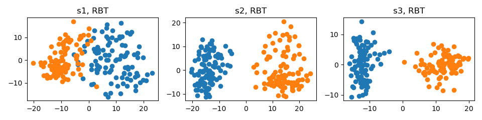
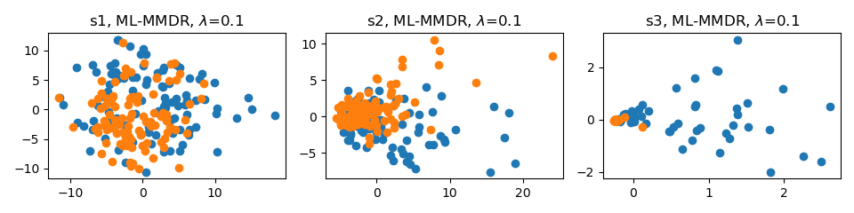
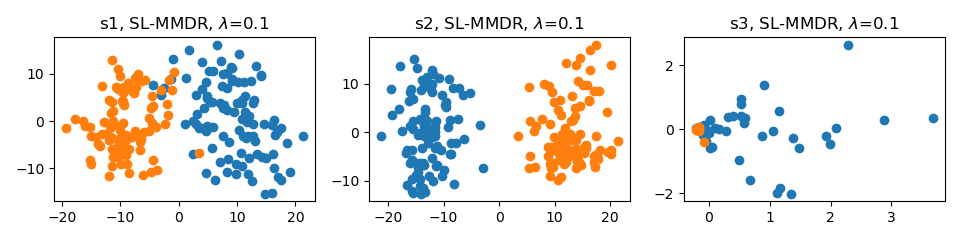

# Multi-Level-MMD-Regularization (PyTorch)

<div align=center>  </div>

<div align=center>  </div>

<div align=center>  </div>

[Enhancing Backdoor Attacks with Multi-Level MMD Regularization](https://ieeexplore.ieee.org/document/9743735)

Pengfei Xia, Hongjing Niu, Ziqiang Li, and Bin Li, *IEEE Transactions on Dependable and Secure Computing*, 2022.

>Abstract: *While Deep Neural Networks (DNNs) excel in many tasks, the huge training resources they require become an obstacle for practitioners to develop their own models. It has become common to collect data from the Internet or hire a third party to train models. Unfortunately, recent studies have shown that these operations provide a viable pathway for maliciously injecting hidden backdoors into DNNs. Several defense methods have been developed to detect malicious samples, with the common assumption that the latent representations of benign and malicious samples extracted by the infected model exhibit different distributions. However, it is still an open question whether this assumption holds up. In this paper, we investigate such differences thoroughly via answering three questions: 1) What are the characteristics of the distributional differences? 2) How can they be effectively reduced? 3) What impact does this reduction have on difference-based defense methods? First, the distributional differences of multi-level representations on the regularly trained backdoored models are verified to be significant by adopting Maximum Mean Discrepancy (MMD), Energy Distance (ED), and Sliced Wasserstein Distance (SWD) as the metrics. Then, ML-MMDR, a difference reduction method that adds multi-level MMD regularization into the loss, is proposed, and its effectiveness is testified on three typical difference-based defense methods. Across all the experimental settings, the F1 scores of these methods drop from 90%-100% on the regularly trained backdoored models to 60%-70% on the models trained with ML-MMDR. These results indicate that the proposed MMD regularization can enhance the stealthiness of existing backdoor attack methods.*

## Training

```python
# Train VGG-11 on CIFAR-10 without ML-MMDR
python main.py --data_path your_path --data_name cifar10 --model_name vgg11 --mlmmdr_lamb 0

# Train VGG-11 on CIFAR-10 with ML-MMDR and lambda set to 0.1
python main.py --data_path your_path --data_name cifar10 --model_name vgg11 --mlmmdr_lamb 0.1 --mlmmdr_layer all

# Train VGG-11 on CIFAR-10 with SL-MMDR and lambda set to 0.1
python main.py --data_path your_path --data_name cifar10 --model_name vgg11 --mlmmdr_lamb 0.1 --mlmmdr_layer last
```

## Visualizing

```python
# Visualize VGG-11 trained on CIFAR-10 without ML-MMDR
python visualize.py --data_path your_path --data_name cifar10 --model_name vgg11 --mlmmdr_lamb 0

# Visualize VGG-11 trained on CIFAR-10 with ML-MMDR and lambda set to 0.1
python visualize.py --data_path your_path --data_name cifar10 --model_name vgg11 --mlmmdr_lamb 0.1 --mlmmdr_layer all

# Visualize VGG-11 trained on CIFAR-10 with SL-MMDR and lambda set to 0.1
python visualize.py --data_path your_path --data_name cifar10 --model_name vgg11 --mlmmdr_lamb 0.1 --mlmmdr_layer last
```

## Citation

If you find this work useful for your research, please consider citing our paper:

```
@article{xia2022enhancing,
  title={Enhancing Backdoor Attacks with Multi-Level MMD Regularization},
  author={Xia, Pengfei and Niu, Hongjing and Li, Ziqiang and Li, Bin},
  journal={IEEE Transactions on Dependable and Secure Computing},
  year={2022}
  publisher={IEEE}
}
```

## Note

We trained the backdoor models without hooks in our paper, and recently found that the models trained without hooks performed better than the models trained with hooks. We also do not know the reason behind this. Therefore, to achieve similar results as in the published paper, we recommend not using hooks, even though it makes the code unsightly.
